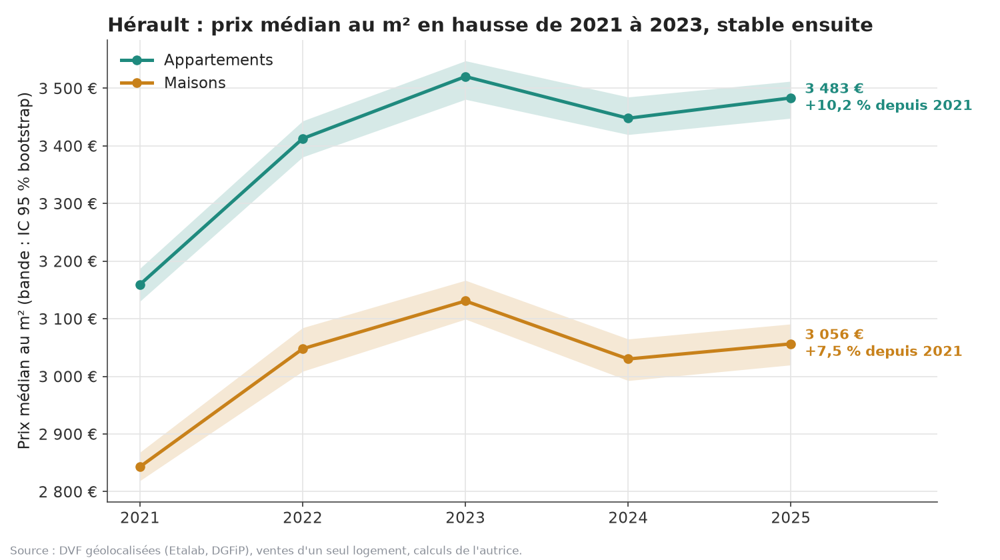
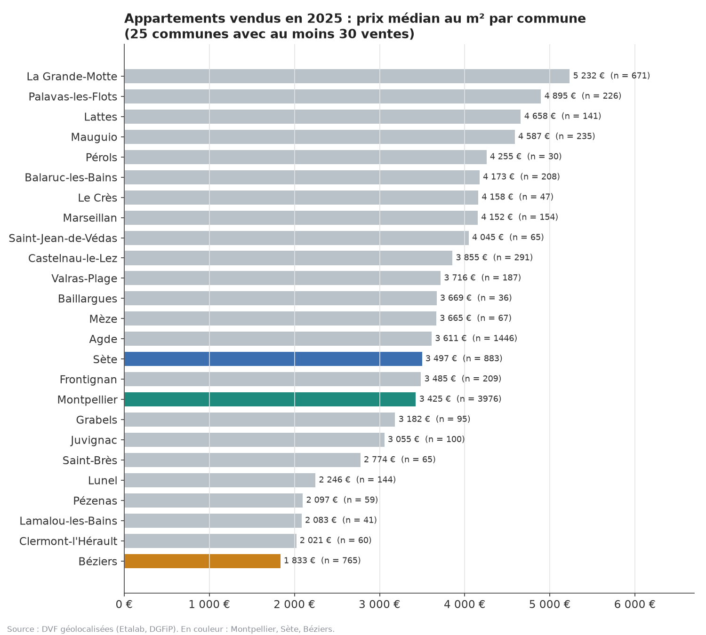

# Marché immobilier de l'Hérault : des DVF brutes aux indicateurs publiables

Analyse des Demandes de valeurs foncières (DVF géolocalisées, Etalab) pour le département de l'Hérault (34),
millésimes 2021 à 2025 : nettoyage chiffré avec DuckDB, indicateurs de prix et de volumes, modèle en étoile et
mesures DAX documentés pour Power BI, et une démo Streamlit qui tourne directement dans le navigateur.

- Démo : <https://yzasmin.github.io/dvf-herault-immobilier/demo/>
- Notebook exécuté : <https://yzasmin.github.io/dvf-herault-immobilier/notebook.html>

## Problème

Acheteurs, agences et collectivités ont la même question : **où en sont les prix et les volumes de vente, commune
par commune ?** Les DVF sont publiques et gratuites, mais inexploitables telles quelles : une vente s'étale sur
plusieurs lignes, la valeur foncière est répétée sur chacune (la sommer compte le prix plusieurs fois), les ventes
de parkings, de terrains et de lots multiples se mélangent aux ventes de logements, et des prix au m² à 50 euros
voisinent avec des prix à 50 000 euros.

Ce dépôt répond à trois besoins :

1. un **nettoyage justifié et chiffré**, où chaque ligne retirée est comptée et expliquée ;
2. des **indicateurs stables** (médianes, seuil minimal de ventes, intervalles de confiance) plutôt que des moyennes
   tirées par quelques ventes exceptionnelles ;
3. une **livraison utilisable** : modèle Power BI prêt à importer, démo publique consultable sans rien installer.

## Résultats

Période : ventes du 04/01/2021 au 31/12/2025. 412 496 lignes brutes, 178 905 mutations, **105 463 ventes retenues**
(58,9 % des mutations) après les neuf règles de nettoyage.

| Indicateur (Hérault) | 2021 | 2025 | Évolution |
| --- | --- | --- | --- |
| Prix médian au m², appartements | 3 159,55 € | 3 483,33 € | +10,2 % (IC 95 % : +8,8 % à +11,6 %) |
| Prix médian au m², maisons | 2 843,19 € | 3 056,48 € | +7,5 % (IC 95 % : +6,0 % à +9,1 %) |
| Prix médian au m², tous logements | 3 006,67 € | 3 301,08 € | +9,8 % |
| Nombre de ventes retenues | 24 809 | 19 453 | -21,6 % (creux en 2024 : 17 147, soit -30,9 % par rapport à 2021) |
| Valeur médiane d'une vente | 173 850 € | 183 737 € | +5,7 % |



Points marquants, tous vérifiables dans `results/` :

- **La hausse s'arrête en 2023.** Le prix médian au m² culmine en 2023 (3 355,77 € tous logements), recule en 2024
  (-2,7 %) et remonte à peine en 2025 (+1,1 %). Les prix sont nominaux : corrigés de l'inflation, ces cinq années
  ressembleraient plutôt à une stagnation.
- **Le volume a beaucoup plus bougé que les prix** : -30,9 % de ventes entre 2021 et 2024, +13,4 % en 2025.
- **Le littoral domine.** En 2025, parmi les 25 communes publiables pour les appartements, La Grande-Motte est la
  plus chère (5 232 €/m²) et Béziers la moins chère (1 833 €/m²), soit un rapport de 2,9. Sète (3 497 €/m²) passe
  devant Montpellier (3 425 €/m²), qui n'arrive qu'au 17e rang.
- **Les communes les moins chères en 2021 sont celles qui ont le plus augmenté** : corrélation de rang de Spearman
  entre prix 2021 et évolution 2021-2025 de -0,65 pour les appartements (22 communes, p = 0,0017 par test de
  permutation) et -0,32 pour les maisons (82 communes, p = 0,0030). L'effet de régression vers la moyenne va dans
  le même sens, donc ce résultat suggère un rattrapage sans le démontrer.

### Le nettoyage, étape par étape

| # | Règle | Unité | Retirées | Restantes |
| --- | --- | --- | --- | --- |
| 1 | Doublons exacts (ligne identique sur les 40 colonnes) | lignes | 20 254 (4,9 %) | 392 242 |
| 2 | Mutation cohérente (une date, une nature, une valeur) | mutations | 4 | 178 901 |
| 3 | Nature « Vente » seule (hors VEFA, échange, adjudication, expropriation, terrain à bâtir) | mutations | 16 767 (9,4 %) | 162 134 |
| 4 | Valeur foncière renseignée et positive | mutations | 156 | 161 978 |
| 5 | Aucun local industriel ou commercial dans la mutation | mutations | 8 414 (5,2 %) | 153 564 |
| 6 | Au moins un logement (retire terrains nus et dépendances seules) | mutations | 37 962 (24,7 %) | 115 602 |
| 7 | Un seul logement (prix global non ventilable au-delà) | mutations | 5 229 (4,5 %) | 110 373 |
| 8 | Surface bâtie entre 9 et 1 000 m² | mutations | 19 | 110 354 |
| 9 | Prix au m² hors [Q1 - 1,5 IQR ; Q3 + 1,5 IQR] du logarithme, par type et par année | mutations | 4 891 (4,4 %) | **105 463** |

Détail complet : `results/journal_nettoyage.csv`, bornes dans `results/bornes_aberrants.csv`, répartition des
retraits dans `results/retraits_aberrants_par_type.csv`. La règle 9 est appliquée au logarithme du prix au m² parce
que la distribution est très dissymétrique : sans logarithme, la borne basse serait négative et ne retirerait rien,
alors que 90 % des aberrants retirés le sont par le bas (4 405 sur 4 891) (ventes entre proches, parts indivises, viagers).

### Publication par commune

Une médiane de commune n'est publiée qu'à partir de **30 ventes** dans l'année pour le type de bien concerné. En
2025, cela laisse 25 communes sur 143 pour les appartements (93 % des ventes d'appartements) et 83 communes sur 319
pour les maisons (74 % des ventes de maisons) : `results/couverture_communes.csv`.



## Reproduire depuis un clone vierge

Pré-requis : [uv](https://docs.astral.sh/uv/) et Python 3.11 ou 3.12. Aucune clé ni aucun compte n'est nécessaire.

```bash
git clone https://github.com/yzasmin/dvf-herault-immobilier.git
cd dvf-herault-immobilier
uv sync                                        # environnement (DuckDB, pandas, matplotlib, Streamlit)
uv run python scripts/telecharger.py           # 5 fichiers .csv.gz, environ 11 Mo, vers data/raw/
uv run python scripts/pipeline.py              # nettoyage, modèle en étoile, results/ et app/data/ (environ 1 min 30)
uv run python scripts/figures.py               # figures/*.png et teaser/figure-teaser.png
uv run pytest -q                               # 6 tests : règles de regroupement et cohérence des sorties
uv run python scripts/construire_notebook.py
uv run jupyter nbconvert --to notebook --execute --inplace notebooks/analyse.ipynb
uv run jupyter nbconvert --to html --output-dir notebooks notebooks/analyse.ipynb
uv run streamlit run app/streamlit_app.py      # démo en local, http://localhost:8501
```

Le poste de développement dispose de 8 Go de RAM dont souvent moins de 1 Go libre : DuckDB est limité à 600 Mo
(`SET memory_limit='600MB'`), lit les `.csv.gz` sans les décompresser sur le disque, et le bootstrap est calculé par
lots de 100 rééchantillons.

## Structure

```
scripts/     telecharger.py, pipeline.py, figures.py, construire_notebook.py
sql/         01_brut.sql ... 05_indicateurs.sql (nettoyage, modèle en étoile, indicateurs)
results/     tous les chiffres publiés (CSV et JSON) : c'est la source de la fiche et de ce README
app/         streamlit_app.py et app/data/*.csv (agrégats légers, environ 150 Ko)
pages/       page d'accueil et page de la démo stlite publiées sur GitHub Pages
powerbi/     mesures.dax, MODELE.md, tables/ (dimensions sans donnée individuelle)
notebooks/   analyse.ipynb exécuté et analyse.html
figures/     graphiques du README et de la fiche
teaser/      variables.json et figure sombre 1600x900 pour la vidéo de présentation
tests/       tests pytest (règles de regroupement sur données synthétiques, cohérence des sorties)
data/        ignoré par git : fichiers bruts téléchargés et tables du modèle en étoile
```

## Données et licence

- Source : **Demandes de valeurs foncières géolocalisées**, Etalab, à partir des DVF de la DGFiP :
  <https://www.data.gouv.fr/fr/datasets/demandes-de-valeurs-foncieres-geolocalisees/>. Fichiers départementaux
  annuels `https://files.data.gouv.fr/geo-dvf/latest/csv/<annee>/departements/34.csv.gz`.
- Millésimes disponibles au 22/09/2026 : **2021 à 2025** (le serveur conserve cinq années glissantes), fichiers
  publiés le 18/05/2026. Mise à jour semestrielle (avril et octobre) ; chaque mise à jour remplace l'intégralité des
  fichiers précédents et peut ajouter des mutations sur les années passées. Empreintes SHA-256 des fichiers utilisés :
  `results/sources.json`.
- Licence des données : **Licence Ouverte / Open Licence 2.0**, avec les conditions générales d'utilisation DVF
  prévues par l'article R. 112 A-3 du Livre des procédures fiscales : les réutilisations **ne doivent pas permettre
  la réidentification des personnes** et les informations **ne peuvent pas être indexées par les moteurs de
  recherche**. Conséquences appliquées ici : aucune vente individuelle n'est commitée ni publiée (seuls des agrégats,
  avec un seuil de 30 ventes par commune), et les pages publiées portent `<meta name="robots" content="noindex,
  nofollow">`.
- Périmètre : l'Alsace, la Moselle et Mayotte ne figurent pas dans les DVF (livre foncier propre). L'Hérault est
  couvert intégralement.
- Licence du code de ce dépôt : MIT (fichier `LICENSE`).

## Limites

- **Prix nominaux.** Aucune correction de l'inflation : la hausse de 9,8 % sur cinq ans doit se lire en euros
  courants.
- **DVF ne décrit pas les biens.** Ni état, ni étage, ni vue, ni DPE, ni ascenseur. Un écart entre deux communes
  mélange l'effet de localisation et la différence des biens vendus. Aucune modélisation hédonique n'a été faite.
- **Le terrain est inclus dans le prix des maisons** : leur prix au m² bâti est mécaniquement gonflé quand le
  terrain est grand.
- **59 % des mutations sont conservées.** Les ventes en bloc, les ventes mixtes logement plus commerce et surtout
  les VEFA (logements neufs vendus sur plan, 14 343 mutations) sont exclues : le marché du neuf est donc absent.
- **Délai et complétude.** Les DVF sont publiées deux fois par an avec plusieurs mois de décalage, et l'année la
  plus récente peut encore se compléter. Les actes non soumis à publicité foncière (successions, donations) n'y
  figurent jamais.
- **Power BI Desktop n'est pas installé sur le poste** (vérifié le 22/09/2026) : les mesures DAX de
  `powerbi/mesures.dax` sont documentées mais n'ont pas été exécutées. Chaque chiffre publié est recalculé en SQL
  avec la même définition, mesure par mesure, dans `results/mesures_dax_sql.csv`.
- **Le seuil de 30 ventes écarte la majorité des communes rurales** : l'analyse communale ne vaut que pour les
  communes les plus actives.
- **La démo stlite télécharge Python dans le navigateur** (environ 30 Mo au premier accès, quelques dizaines de
  secondes) : c'est le prix à payer pour une démo publique sans serveur ni compte tiers.

## Crédits

Yasmina Saoud, septembre 2026. Données : DGFiP et Etalab. Outils : uv, DuckDB, pandas, matplotlib, Altair,
Streamlit, stlite, Jupyter.
